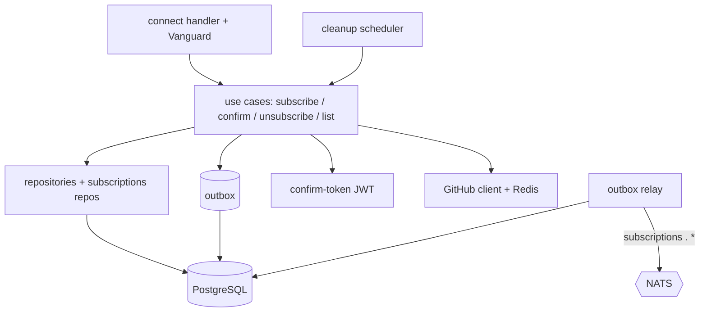
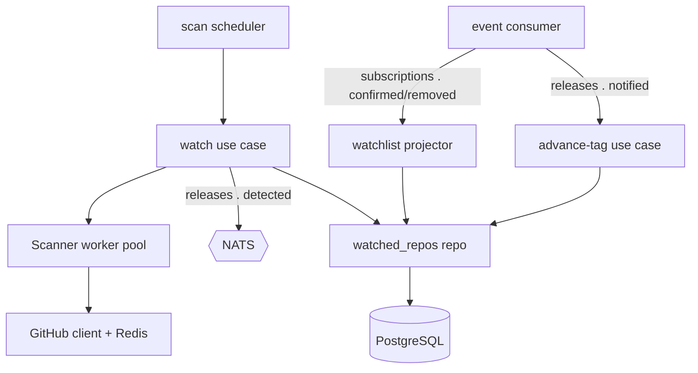
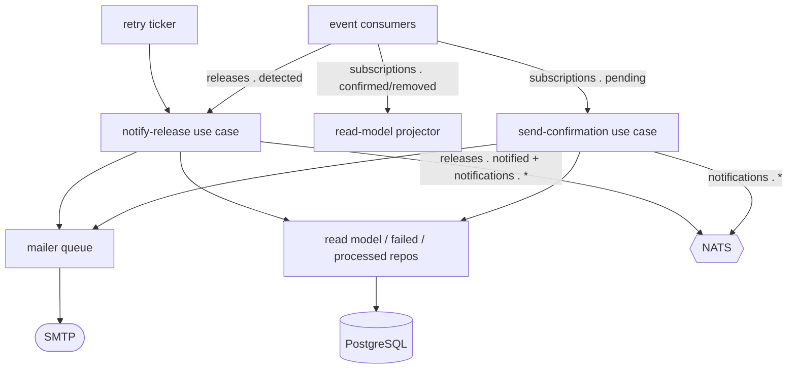
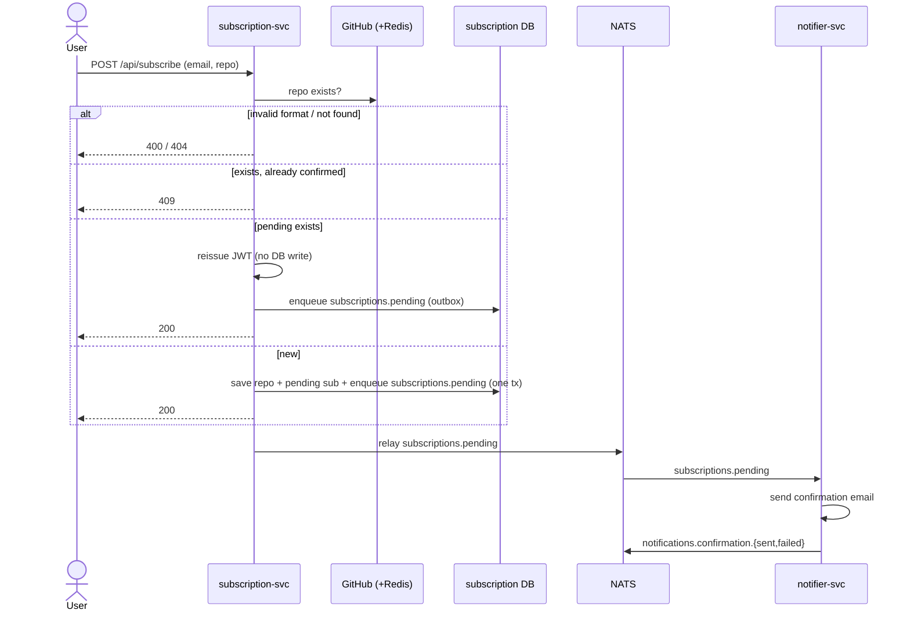
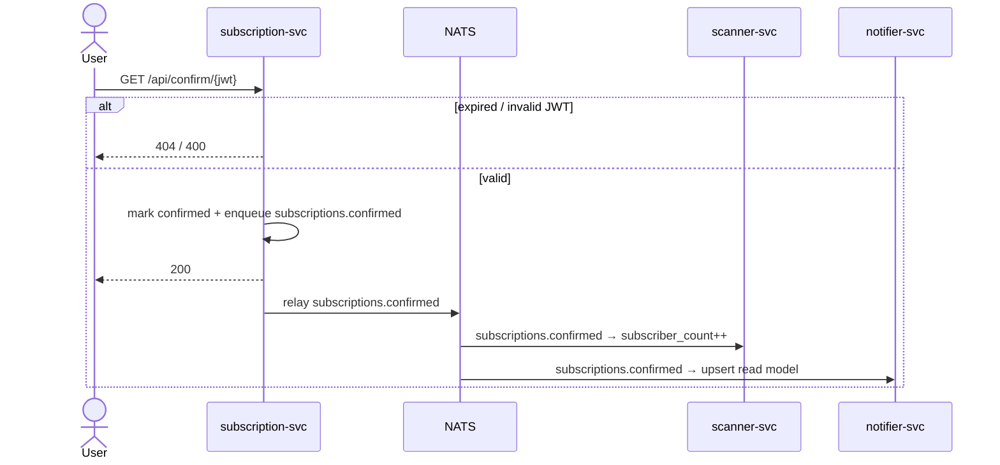
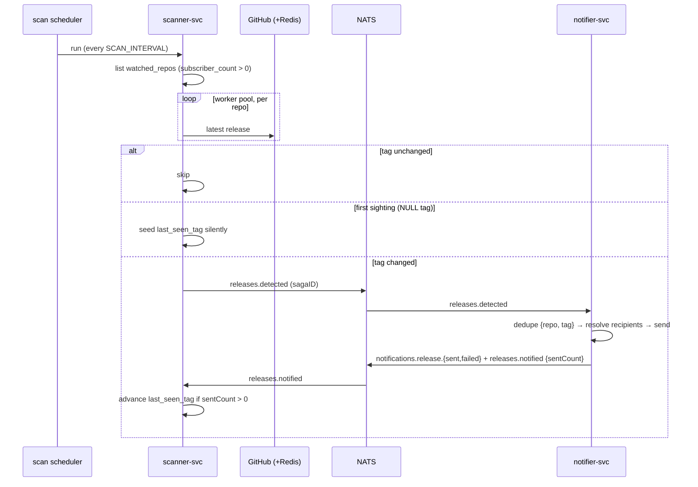
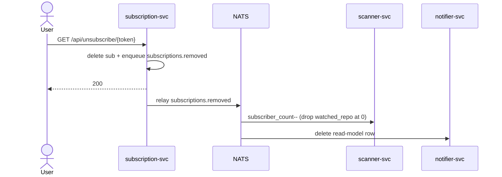
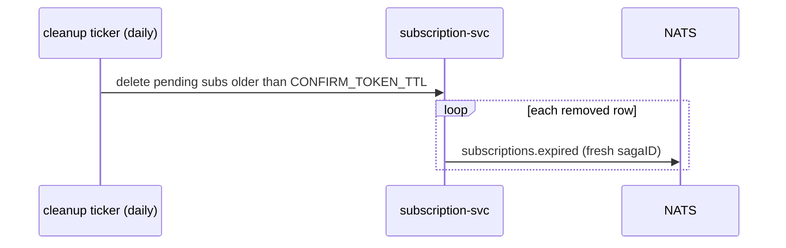
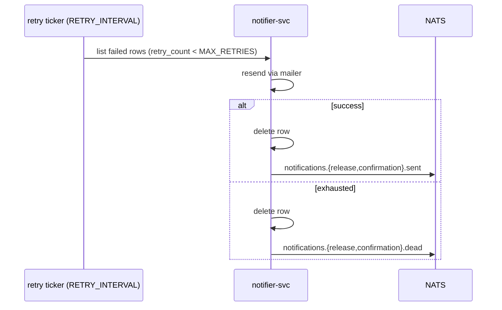

# System Design

GitHub Release Notifier — three autonomous, event-driven services that watch GitHub repositories and
email subscribers when a new release appears. This document reflects the current architecture
([ADR-012](adr/012-event-driven-services.md)).

## System Requirements

### Functional Requirements

1. A subscription is created from an email and a repository in `owner/repo` format; the repository is
   verified against the GitHub API before saving.
2. A new subscription is pending until the user clicks a one-time confirmation link (a stateless
   JWT) emailed to them; confirming activates it.
3. Re-subscribing to a still-pending repository reissues a fresh confirmation link without a DB write;
   re-subscribing to an already-confirmed one is rejected (409).
4. Every release-notification email contains a personal unsubscribe link.
5. All subscriptions for an email (pending and confirmed, with status) can be listed via the API.
6. The scanner checks every watched repository on a fixed interval and, when a new release tag
   appears, the notifier emails the confirmed subscribers. Each repository tracks a single
   `last_seen_tag`, so only a newer tag triggers email.
7. A failed email is retried; once retries are exhausted, it is dead-lettered.
8. All four operations (subscribe, confirm, unsubscribe, list) are available over both REST and gRPC.

### Non-Functional Requirements

1. Three autonomous services (`subscription`, `scanner`, `notifier`), each owning its own PostgreSQL, communicating
   only over a NATS JetStream event bus — no synchronous service-to-service calls.
2. Events are JSON (`internal/shared/events`, validated with struct tags); protobuf is used only for the public API.
3. Confirmation tokens are stateless JWTs; unsubscribe tokens are random DB tokens.
4. Hexagonal architecture inside each module over a modulith layout; boundaries enforced by `depguard`.
5. A single shared Redis caches GitHub responses (10-min TTL) for both subscription and scanner.
6. Each service embeds its schema and runs `golang-migrate` on startup; the outbox migration is applied alongside the
   subscription schema.
7. Write/read RPCs are optionally protected by a static API key (`Authorization: Bearer`), uniform across REST, Connect,
   and gRPC.
8. Prometheus `/metrics` (Grafana) + structured JSON `slog` logs shipped by Filebeat to Elasticsearch (Kibana). Each
   service exposes `/metrics` and `/health`.
9. The whole stack starts with `docker compose up`.
10. CI runs lint, race-detected unit tests, and integration tests on every push.

### Limitations

- Subscriber state is replicated across three stores (subscription source of truth, scanner count-only,
  notifier read model) → eventual consistency.
- Delivery is at-least-once: a redelivered event can cause duplicate work; release emails are deduplicated via
  `processed_releases{repo_name, tag}`.
- Detection latency is up to `SCAN_INTERVAL` and the GitHub cache TTL.
- The mailer's in-process dispatch queue is the final SMTP hop only; durability lives upstream (JetStream redelivery +
  `failed_notifications` retry).
- No saga-orchestrator yet — `sagaID` is carried as a seam only ([ADR-012](adr/012-event-driven-services.md)).

---

## Architecture

### subscription-svc

### scanner-svc

### notifier-svc

---

## Key Flows

### Subscribe

### Confirm

### Scan → release notification

### Unsubscribe

### Pending cleanup → expired

### Retry / dead-letter (notifier)

---

## Events & Message Bus

Services exchange JSON events over NATS JetStream ([ADR-012](adr/012-event-driven-services.md)). Every
payload carries a `sagaID` (UUID). Subjects, payloads, and ownership:

| Stream          | Subject                                         | Payload (besides `sagaID`)             | Producer → Consumers             |
|-----------------|-------------------------------------------------|----------------------------------------|----------------------------------|
| `SUBSCRIPTIONS` | `subscriptions.pending`                         | email, repoName, confirmURL            | subscription → notifier          |
|                 | `subscriptions.confirmed`                       | email, repoName, unsubToken            | subscription → scanner, notifier |
|                 | `subscriptions.removed`                         | email, repoName                        | subscription → scanner, notifier |
|                 | `subscriptions.expired`                         | email, repoName                        | subscription → (saga, future)    |
| `RELEASES`      | `releases.detected`                             | repoName, tag, releaseURL              | scanner → notifier               |
|                 | `releases.notified`                             | repoName, tag, sentCount, failedEmails | notifier → scanner               |
| `NOTIFICATIONS` | `notifications.confirmation.{sent,failed,dead}` | email, reason?                         | notifier → (saga, future)        |
|                 | `notifications.release.{sent,failed,dead}`      | repoName, tag, email, reason?          | notifier → (saga, future)        |

**Delivery semantics:**

- At-least-once with explicit ack; the broker maps a handler outcome to `Ack` / `Nak` (redeliver,
  bounded by `MaxDeliver`) / `Term` (poison, dropped — e.g., a validation failure via
  `broker.ErrTerminal`).
- **Transactional outbox** (subscription only): each `subscriptions.*` event is enqueued in the same tx
  as the row change and relayed after commit. The scanner and notifier publish **directly** — their
  flows are self-healing.
- **Idempotency:** `processed_releases{repo_name, tag}` dedupes a redelivered/re-detected release so
  it is emailed once.
- **Lost-batch guarantee:** the scanner advances `last_seen_tag` only after `releases.notified` with
  `sentCount > 0`.

---

## Public API

Served by `subscription-svc` from one connect-go handler fronted by Vanguard
([ADR-011](adr/011-connect-transcoding.md)) on `SUBSCRIPTION_PORT` (default 8080) — REST + Connect +
gRPC + gRPC-Web on one port. Contract: `proto/subscription/v1/subscription.proto`.

| Method | Path                        | RPC                 | Auth    |
|--------|-----------------------------|---------------------|---------|
| `POST` | `/api/subscribe`            | `Subscribe`         | API key |
| `GET`  | `/api/confirm/{token}`      | `Confirm`           | —       |
| `GET`  | `/api/unsubscribe/{token}`  | `Unsubscribe`       | —       |
| `GET`  | `/api/subscriptions?email=` | `ListSubscriptions` | API key |
| `GET`  | `/health` · `/metrics`      | —                   | —       |

Confirm/unsubscribe are public (opened from email links in a browser). The gRPC health service and
server reflection are registered; validation is declarative via protovalidate.

Error mapping (`internal/subscription/adapter/connectrpc/errors.go`); Vanguard turns the connect code
into the HTTP status for REST callers:

| Condition                                                   | connect code      | HTTP |
|-------------------------------------------------------------|-------------------|------|
| invalid repo format / protovalidate / invalid confirm token | `InvalidArgument` | 400  |
| missing / wrong API key                                     | `Unauthenticated` | 401  |
| repo not found / token not found / expired confirm link     | `NotFound`        | 404  |
| already subscribed (confirmed)                              | `AlreadyExists`   | 409  |
| anything else                                               | `Internal`        | 500  |

---

## Observability

- **Metrics** (`internal/infrastructure/metrics`, Prometheus, exposed per service at `/metrics`):
  `requests_total` / `request_duration_seconds` (public API, by protocol/procedure/code);
  `events_published_total` / `events_consumed_total` (by subject and result — the event-bus throughput);
  `scanner_runs_total` / `scanner_duration_seconds` / `scanner_errors_total`;
  `subscription_operations_total`; `db_queries_total` / `db_query_errors_total` /
  `db_query_duration_seconds`; `cache_operations_total` / `cache_operation_duration_seconds`;
  `email_sends_total` / `email_send_duration_seconds`; `github_api_requests_total` /
  `github_api_request_duration_seconds` / `github_api_errors_total`.
- **Logs:** structured JSON via `slog`, carrying `request_id`, `scan_id`, and `saga_id` from context.
  Shipped by Filebeat → Elasticsearch → Kibana.
- **Dashboards:** Prometheus → Grafana for metrics; Kibana for logs (both auto-provisioned under
  `observability/`).

---

## Configuration

Config is read from environment variables via `envconfig`, one loader per service. The single
connection URLs (`DATABASE_URL`, `REDIS_URL`, `NATS_URL`) are assembled by Docker Compose from
component variables; see [`.env.example`](../.env.example) for the full set. Per-service variables:

**subscription** (`config.LoadSubscription`): `SUBSCRIPTION_PORT` (8080), `BASE_URL`, `GITHUB_TOKEN`,
`DATABASE_URL`*, `REDIS_URL`*, `NATS_URL`, `JWT_SECRET`*, `CONFIRM_TOKEN_TTL` (24h),
`PENDING_CLEANUP_INTERVAL` (24h), `API_KEY`, `LOG_LEVEL`.

**scanner** (`config.LoadScanner`): `SCANNER_PORT` (8082), `GITHUB_TOKEN`, `SCAN_WORKERS` (5),
`SCAN_INTERVAL` (10m), `DATABASE_URL`*, `REDIS_URL`*, `NATS_URL`, `LOG_LEVEL`.

**notifier** (`config.LoadNotifier`): `NOTIFIER_PORT` (8081), `NATS_URL`, `DATABASE_URL`*, `BASE_URL`,
`RETRY_INTERVAL` (15m), `MAX_RETRIES` (5), `CONFIRMATION_TTL` (24h), `PROCESSED_RELEASE_TTL` (720h),
`SMTP_HOST`*, `SMTP_PORT` (587), `SMTP_USER`*, `SMTP_PASSWORD`*, `SMTP_FROM`*, `LOG_LEVEL`.

(* required.) The notifier has **no** TLS/cert material — it is a NATS consumer. The Compose-only
variables (`DB_*`, `REDIS_*`, `*_DB_NAME`, `*_DB_PORT`, `ES_*`, `KIBANA_PORT`, `PROMETHEUS_PORT`,
`GRAFANA_*`) are documented in `.env.example`.
