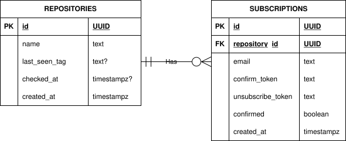

# ADR-001: Primary Database

**Status:** Accepted

**Author:** Zabrodin Maksym

## Context

The service needs storage for repositories and subscriptions. The data is relational: each subscription belongs to one repository, tokens must be globally unique and (email, repository) pairs must be unique.

## Candidates

1. **PostgreSQL**
   - Pro: Foreign keys, UNIQUE constraints and transactions are enforced at the database level
   - Con: Requires a separate running service

2. **MongoDB**
   - Pro: Flexible schema, easy to start with
   - Con: No built-in referential integrity, this data is relational, not document-oriented

3. **SQLite**
   - Pro: Zero infrastructure, single file
   - Con: Serializes writes, not suitable for containerized deployment

## Decision

Use PostgreSQL with `pgxpool` for connection pooling.

**Schema:**

```sql
CREATE TABLE repositories
(
    id            UUID PRIMARY KEY     DEFAULT gen_random_uuid(),
    name          TEXT        NOT NULL UNIQUE,
    last_seen_tag TEXT,
    checked_at    TIMESTAMPTZ,
    created_at    TIMESTAMPTZ NOT NULL DEFAULT NOW()
);

CREATE TABLE subscriptions
(
    id                UUID PRIMARY KEY     DEFAULT gen_random_uuid(),
    repository_id     UUID        NOT NULL REFERENCES repositories (id) ON DELETE CASCADE,
    email             TEXT        NOT NULL,
    confirm_token     TEXT        NOT NULL UNIQUE,
    unsubscribe_token TEXT        NOT NULL UNIQUE,
    confirmed         BOOLEAN     NOT NULL DEFAULT FALSE,
    created_at        TIMESTAMPTZ NOT NULL DEFAULT NOW(),
    UNIQUE (email, repository_id)
);

CREATE INDEX idx_subscriptions_email ON subscriptions (email);
```



- **`last_seen_tag` is on `repositories`, not `subscriptions`:** the scanner makes one GitHub API call per repository per tick, regardless of subscriber count.
- **`confirmed` is a boolean, not an enum:** the subscription has exactly two states.

## Consequences

**Pros:**
- UNIQUE constraints on tokens and (email, repository_id) enforce correctness at the database level
- Email index makes `GET /api/subscriptions?email=...` fast without a full table scan

**Cons:**
- Requires a running PostgreSQL instance
