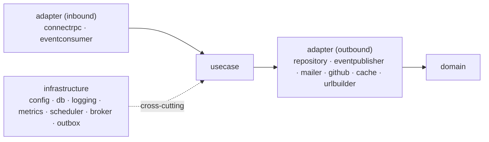

# ADR-008: Hexagonal Architecture

**Status:** Accepted

**Author:** Zabrodin Maksym

## Context

Each service has parts that change for unrelated reasons: transport (the public API; NATS event
consumers), storage (PostgreSQL), and external providers (GitHub, SMTP, Redis). Business logic should
not be coupled to any of them, so it can be unit-tested in isolation, and so a transport or provider can
be swapped without rewriting rules.

## Candidates

1. **By technical layer (flat)** — `service` / `repository` / `api` packages
    - Pro: simple, familiar
    - Con: business logic tends to import framework and driver types directly, making it hard to test and to add a
      second transport

2. **Hexagonal / ports & adapters** — use cases at the core, everything else is an adapter
    - Pro: business logic depends only on interfaces it defines; transports and providers are pluggable
    - Con: more packages and interface boilerplate

## Decision

Adopt ports and adapters. Dependencies point inward:

The layers live inside each module (`internal/<module>/{domain,usecase,adapter}`):

- **`domain`** — domain types and constructors; the shared kernel `internal/shared/domain` holds the
  cross-module `Release` + sentinel errors (see [ADR-010](010-modulith-bounded-contexts.md)).
- **`usecase`** — business logic. Each use case declares its own narrow port interfaces
  (consumer-defined) and exposes `Execute(ctx, In) (Out, error)`.
- **`adapter`** — implementations of those ports:
    - inbound: `connectrpc` (the public Connect/Vanguard handler), `eventconsumer` (NATS)
    - outbound: `repository` (pgx), `eventpublisher` (NATS), `mailer` (SMTP), plus shared `github` /
      `cache` (Redis) / `urlbuilder`
- **`internal/infrastructure/*`** — cross-cutting plumbing (`config`, `db`, `logging`, `metrics`,
  `scheduler`, `broker`, `outbox`).
- **`internal/bootstrap/<service>` + `cmd/<service>`** — composition roots; construct concrete
  adapters and inject them into use cases.

A metrics decorator (`metrics.NewMetered`) wraps any use case uniformly.

## Consequences

**Pros:**

- Business logic is independent of transport, storage, and external providers
- Each use case is unit-testable with inline mocks of its own small interfaces
- Swapping a transport or provider touches only an adapter — this is what lets the in-process scanner
  and emailer links become independent NATS-connected services ([ADR-012](012-event-driven-services.md))
- Clear, enforceable dependency direction

**Cons:**

- More packages and indirection than a flat layout
- Consumer-defined interfaces add some boilerplate
- Explicit mapping between layer representations (proto message ↔ `domain` ↔ JSON event)
