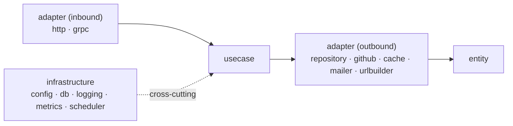

# ADR-008: Hexagonal Architecture

**Status:** Accepted

**Author:** Zabrodin Maksym

## Context

The service has several moving parts that change for unrelated reasons: the
transport (HTTP and gRPC), the database (PostgreSQL), and external services
(GitHub, SMTP, Redis). Business logic — subscribe, confirm, unsubscribe, list,
scan — should not be coupled to any of them, so it can be unit-tested in isolation
and so transports or providers can be added or swapped without rewriting rules.

## Candidates

1. **By technical layer (flat)** — `service` / `repository` / `api` packages
    - Pro: simple, familiar
    - Con: business logic tends to import framework and driver types directly, making it hard to test and to add a
      second transport

2. **Hexagonal / ports & adapters** — use cases at the core, everything else is an adapter
    - Pro: business logic depends only on interfaces it defines; transports and providers are pluggable
    - Con: more packages and interface boilerplate

## Decision

Adopt ports and adapters. Dependencies point inward:

- **`internal/entity`** — domain types, sentinel errors, repo parsing. No external dependencies.
- **`internal/usecase/{subscribe,confirm,unsubscribe,list,scanner}`** — business logic. Each use case **declares its own
  narrow port interfaces** (consumer-defined) for what it needs, and exposes `Execute(ctx, In) (Out, error)`.
- **`internal/adapter`** — implementations of those ports:
    - inbound: `http` (chi) and `grpc` servers
    - outbound: `repository` (pgx), `github`, `cache` (Redis), `mailer` (SMTP), `urlbuilder`
- **`internal/infrastructure/{config,db,logging,metrics,scheduler}`** — cross-cutting concerns.
- **`cmd/server/main.go`** — composition root; constructs concrete adapters and injects them into use cases.

Because the use cases are transport-agnostic, the HTTP and gRPC adapters wrap the **same** use-case
instances ([ADR-005](005-grpc-api-alongside-rest.md)), and a metrics decorator (`metrics.NewMetered`) can wrap any use
case uniformly.

## Consequences

**Pros:**

- Business logic is independent of transport, storage, and external providers
- Each use case is unit-testable with inline mocks of its own small interfaces
- Adding a transport (gRPC) or swapping a provider touches only an adapter
- Clear, enforceable dependency direction

**Cons:**

- More packages and indirection than a flat layout
- Consumer-defined interfaces add some boilerplate
- Explicit mapping between layer representations (HTTP DTO ↔ `entity` ↔ protobuf message)
