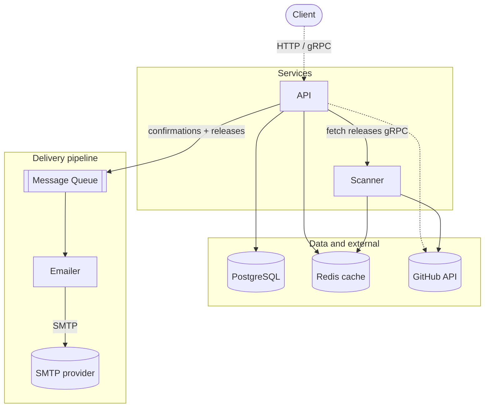

# ADR-009: Split into API, Scanner, and Emailer Services

**Status:** Emailer extraction **Accepted** and implemented. Scanner extraction **Accepted** and
implemented. Moving the Emailer link onto a **message queue** remains **Proposed**.

**Author:** Zabrodin Maksym

## Context

The service is a single binary that bundles three concerns with very different
scaling and failure profiles: request-serving (the API), GitHub polling (the
scanner), and SMTP delivery (the emailer). The in-process mailer also has no
delivery durability — queued mail is lost on a crash (see the cons in
[ADR-006](006-mailer-dispatch-queue.md)).

The hexagonal architecture ([ADR-008](008-hexagonal-architecture.md)) already
isolates these concerns behind ports, so extracting them into separate services is
low friction when the need arises. This ADR records the intended direction; it is
**not yet implemented**.

## Candidates

1. **Stay a modular monolith** — keep everything in one binary
    - Pro: simplest to develop, deploy, and operate
    - Con: it concerns scale together; no delivery durability

2. **Extract the emailer first, then the scanner** — phased split
    - Pro: incremental; each step is independently valuable
    - Con: introduces distributed-system concerns gradually

3. **Full per-concern split up front**
    - Pro: clean target state
    - Con: large, risky change before it is necessary

## Decision

**For now, this ADR commits to one step only: extract the Emailer into its own
microservice**, leaving the API and scanner together in the existing binary. The
mailer already sits behind ports ([ADR-008](008-hexagonal-architecture.md)), so the
app swaps its in-process `Mailer` for a thin client adapter implementing the same
interfaces — no use-case changes. The ADR-006 dispatch design (templates, batch
connection reuse) moves into the new service, which is where durable retries would
later live. The app talks to the Emailer over **gRPC**, consistent with
[ADR-005](005-grpc-api-alongside-rest.md) and the existing buf/protovalidate tooling.

This is the smallest change that delivers value — it isolates SMTP concerns and
keeps the app unblocked by mail delivery — at low risk.

### Implementation notes

#### Emailer extraction (Accepted)

The Emailer now runs as a second binary (`cmd/emailer`) exposing
`notifier.v1.NotifierService` (`proto/notifier/v1/notifier.proto`). The app reaches it
through the `internal/notifier/adapter/emailerclient` outbound adapter, which satisfies the
existing `subscribe` mailer port and `mailer.ReleaseNotifier`'s sender port, so no
use cases changed. The dispatch queue, templates, and SMTP batching from
[ADR-006](006-mailer-dispatch-queue.md) moved unchanged into
`internal/notifier/adapter/emailerserver` and `internal/notifier/adapter/mailer`.

Two decisions were settled during implementation:

- **Transport is secured with mTLS.** Both sides present a certificate signed by a
  shared CA and verify the peer; the emailer requires a valid client certificate
  (`RequireAndVerifyClientCert`, TLS 1.3). There is therefore **no x-api-key**
  interceptor on the internal link — the mutual handshake is the authentication.
  Certificate material is generated by `task certs` (see `internal/infrastructure/certgen`).
- **Confirmation sends stay fire-and-forget.** `emailerclient.SendConfirmation`
  returns immediately and performs the RPC on a background goroutine, so the
  subscription path never blocks on the Emailer. Release sends remain synchronous and
  still return a `BatchResult`; a transport failure is reported as every recipient
  failing so the scanner does not advance the seen tag on a lost batch.

#### Scanner extraction (Accepted)

The Scanner now runs as a third binary (`cmd/scanner`), a reactive GitHub-fetch service the app calls. The
app (`cmd/subscription`) drives each pass: it lists its watched repos, calls
`scanner.v1.ScannerService.FetchLatestReleases` over mTLS, then decides whom to notify. The scanner owns the
GitHub client + Redis cache, makes no decision, and never touches Postgres or the emailer.

- The scanner module owns its whole contract (fetch use case + `scannerserver` + `scannerclient`, stubs in
  `internal/scanner/grpc/gen/scannerv1`); the app consumes the client via a `releaseFetcher` port wired in
  `bootstrap` — the same shape as the notifier.
- Single-role certs: the app mounts a **client** cert (dials out only), the scanner and emailer each a **server**
  cert. No API key — mutual TLS is the authentication.
- On a repo's first sighting (`last_seen_tag` NULL) the `scan` use case **seeds silently — no email**; the
  `confirm` use case instead sends that subscriber the current release (best-effort), so a pre-existing release
  isn't missed and isn't double-sent.

### Future direction (not adopted yet)

Move the **API → Emailer** link off synchronous gRPC onto a **message queue** so delivery is decoupled and email
jobs survive emailer downtime. The bus goes on this single edge only (the scan link stays request/response gRPC),
and would need **outbox + ack** to keep today's guarantee that the app never advances `last_seen_tag` on a lost
batch.

Only the message-queue pipeline remains *Proposed*; the API→Scanner and API→Emailer links are gRPC today.

## Consequences

Of the decided step — extracting the Emailer over gRPC:

**Pros:**

- Isolates SMTP/provider concerns; email can scale and deploy independently
- The app is no longer blocked by mail delivery
- A natural home for durable retries later, without touching use cases (ports unchanged)

**Cons:**

- A network hop and a new failure mode — the app must tolerate the Emailer being
  unavailable (confirmations stay fire-and-forget; release sends still return a
  `BatchResult` over gRPC)
- Another service plus a proto contract to build and operate

The wider three-service split adds further distributed-system complexity (a message
broker, cross-service data consistency, more to operate); those costs are deferred
until that step is actually taken.
