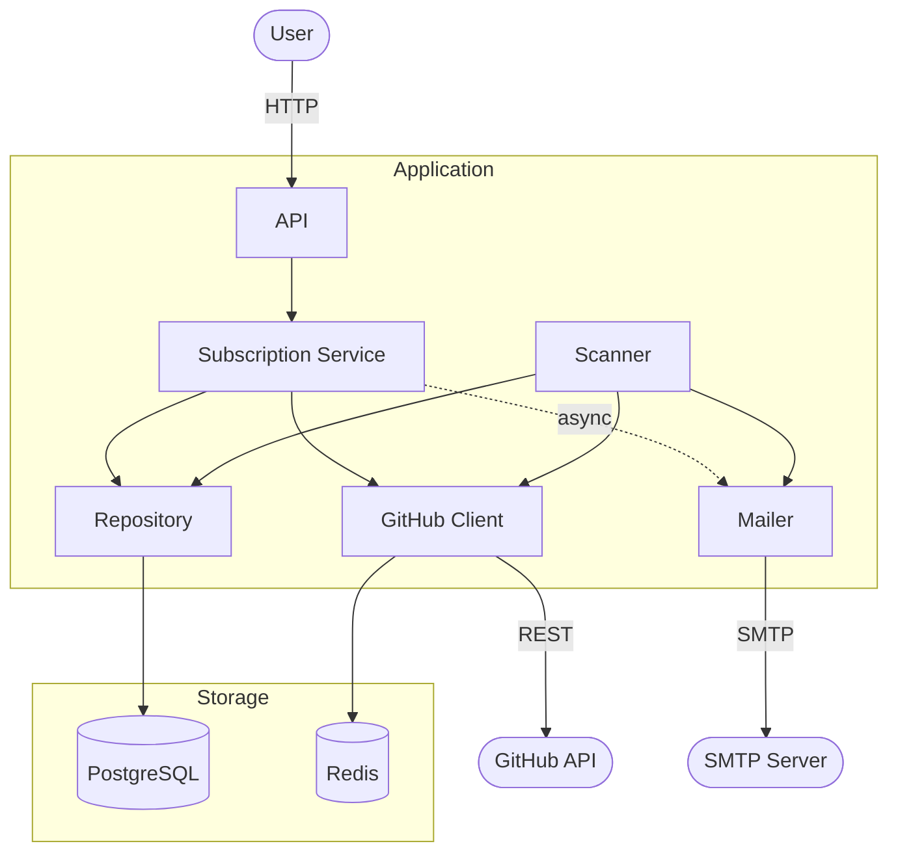
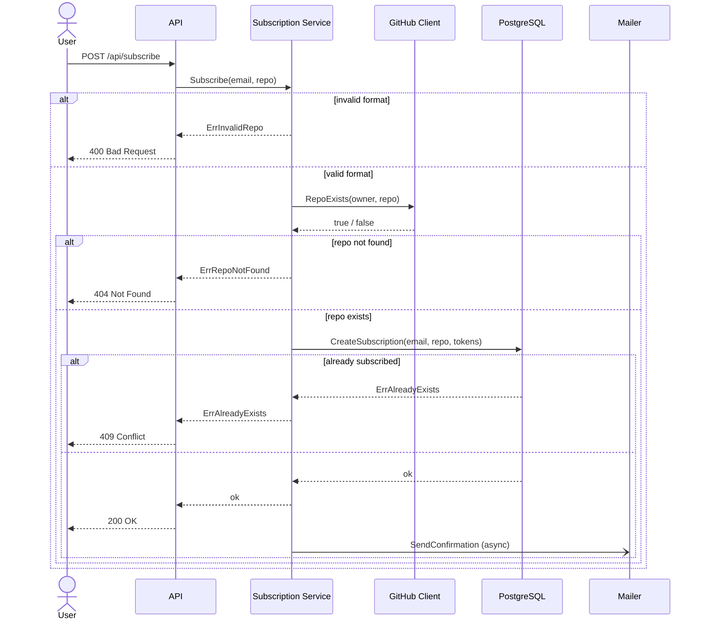
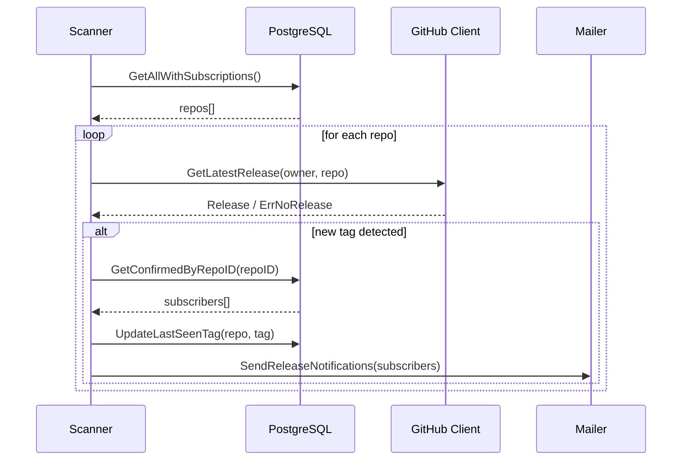

# System Design

## System Requirements

### Functional Requirements

1. Subscription is created by providing an email and a repository in `owner/repo` format. The repository is verified against GitHub API before saving
2. New subscriptions are inactive until the user confirms ownership by clicking a one-time link sent to their email
3. Every release notification email contains a personal unsubscribe link
4. All subscriptions (active and pending) for an email can be listed via API
5. A background scanner checks all repositories with confirmed subscribers on a fixed interval and sends email notifications when a new release tag is detected
6. Each repository stores a single `last_seen_tag`. The scanner notifies only when a newer tag appears, not on every run

### Non-Functional Requirements

1. The service is a Go monolith. A single binary handles the API, scanner and mailer
2. GitHub API responses are cached in Redis with a 10-minute TTL to stay within rate limits (60 req/hour without a token, 5 000 with one)
3. PostgreSQL is used for persistence. Schema migrations run automatically on startup via `golang-migrate`
4. API endpoints are optionally protected with a static API key passed in the `X-API-Key` header
5. Prometheus metrics are exposed at `/metrics`: request counts, latencies, scan durations, notification counts and GitHub error rates
6. The entire system starts with `docker compose up`
7. A GitHub Actions pipeline runs the linter and tests on every push

### Limitations

- Confirmation emails are sent in a background goroutine. Delivery is best-effort with no retries. If the process crashes before sending, the email is lost
- A repo that just published its first release may not be detected for up to one full scanner interval (default 10 minutes)
- GitHub `ETag` conditional requests are not implemented. Every cache refresh after TTL expiry counts against the rate limit quota even if nothing changed
- `last_seen_tag` is updated before emails are sent. If SMTP fails entirely, that release is permanently missed for all subscribers with no way to recover
- The scanner processes repositories sequentially

---

## Architecture

---

## Key Flows

### Subscribe

### Scanner Execution

---

## Component Design

### API (`internal/api`)

| Method | Path                      | Protected | Description                     |
|--------|---------------------------|-----------|---------------------------------|
| POST   | /api/subscribe            | Yes       | Subscribe email to a repository |
| GET    | /api/confirm/{token}      | No        | Confirm subscription            |
| GET    | /api/unsubscribe/{token}  | No        | Unsubscribe                     |
| GET    | /api/subscriptions?email= | Yes       | List subscriptions for an email |
| GET    | /metrics                  | No        | Prometheus metrics              |
| GET    | /health                   | No        | Health check                    |

### Subscription Service (`internal/service`)

Owns all subscription business logic:

- Validates `owner/repo` format and repo existence via GitHub client
- Generates two independent 32-byte random tokens (`confirm_token`, `unsubscribe_token`)
- Persists the subscription, then sends the confirmation email in a background goroutine
- Confirms and unsubscribes by token lookup

### Repository Layer (`internal/repository`)

Two structs backed by `pgxpool.Pool`:

- `RepoRepository` reads and updates the `repositories` table
- `SubscriptionRepository` creates, confirms and removes rows in `subscriptions`

Both map `pgx.ErrNoRows` to `domain.ErrNotFound` and constraint violations to `domain.ErrAlreadyExists`.

### Scanner (`internal/scanner`)

Background goroutine started on service startup. Runs once immediately, then on each execution interval (default 10 minutes). For each cycle:

1. Fetches all repositories with at least one confirmed subscriber
2. Calls GitHub client for the latest release of each repository
3. Compares the tag with `last_seen_tag`. Skips if unchanged or no releases exist
4. Updates `last_seen_tag`, then emails all confirmed subscribers
5. Per-repository errors are logged and skipped. The execution always continues

### GitHub Client (`internal/github`)

HTTP client wrapping the GitHub REST API. Plugs into the Redis cache via `NewClient(token).WithCache(cache, ttl)`. Returns typed sentinel errors (`ErrRateLimited`, `ErrUnauthorized`, `ErrNoRelease`) so callers can handle each case explicitly.

### Mailer (`internal/mailer`)

SMTP client with two methods:

- `SendConfirmation` sends one email per call, invoked from a goroutine by the service
- `SendReleaseNotifications` sends a batch, reusing a single SMTP connection per call, invoked synchronously by the scanner

### Cache (`internal/cache`)

Redis-backed implementation of the `Cache` interface. Cache misses return `domain.ErrMiss`. Any Redis error is treated as a miss and the caller falls through to the real source.

### Metrics (`internal/metrics`)

Prometheus counters and histograms registered at package init:

| Metric                          | Type      | Description                      |
|---------------------------------|-----------|----------------------------------|
| `http_requests_total`           | Counter   | Requests by method, path, status |
| `http_request_duration_seconds` | Histogram | Request latency                  |
| `scanner_runs_total`            | Counter   | Completed scan cycles            |
| `scanner_duration_seconds`      | Histogram | Time per scan cycle              |
| `notifications_sent_total`      | Counter   | Emails sent                      |
| `github_api_errors_total`       | Counter   | GitHub errors by type            |

### Config (`internal/config`)

All configuration is read from environment variables. Connection strings for PostgreSQL and Redis are assembled from individual component vars (`DB_*`, `REDIS_*`) rather than a single URL, making container configuration straightforward.
