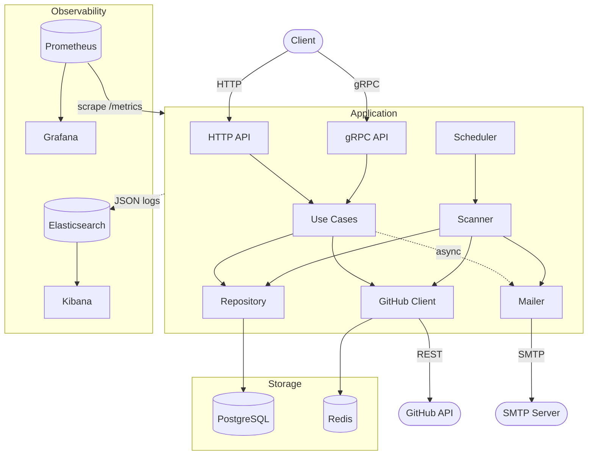
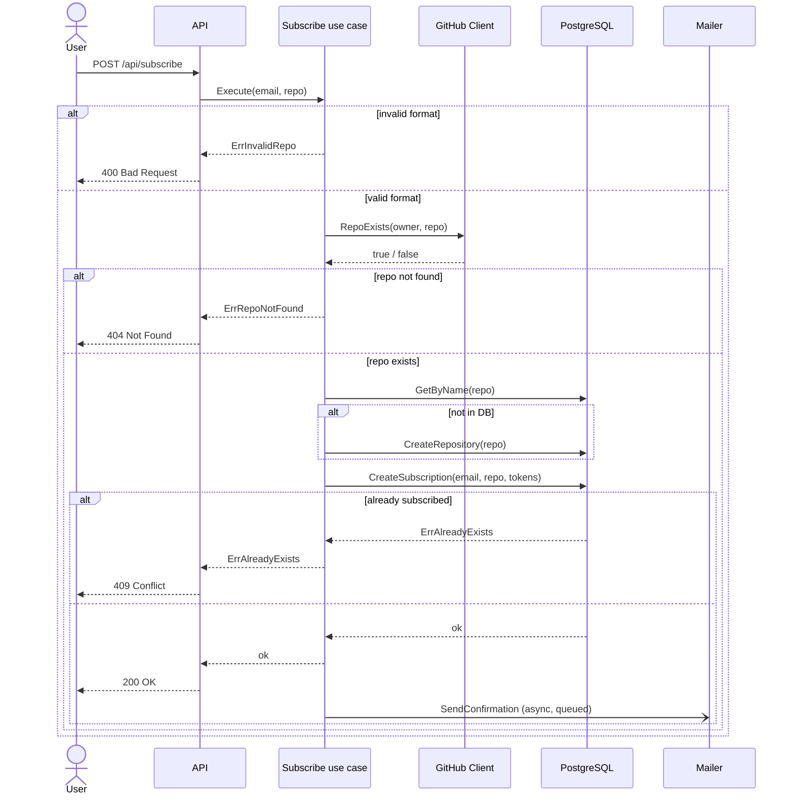
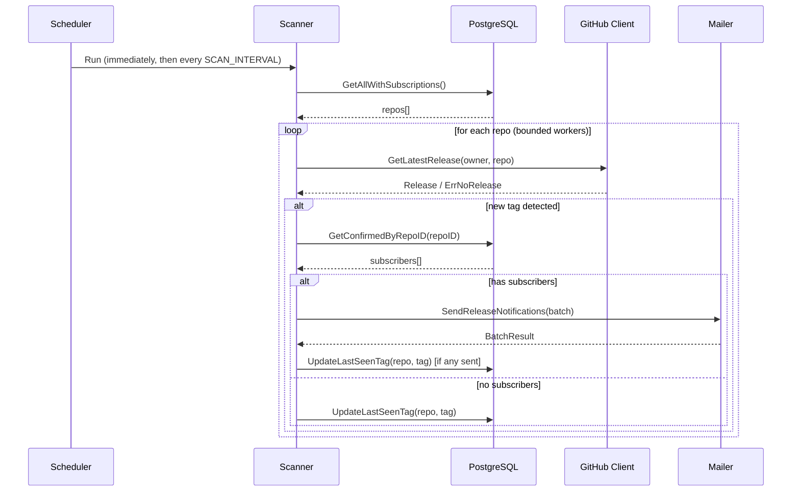

# System Design

## System Requirements

### Functional Requirements

1. Subscription is created by providing an email and a repository in `owner/repo` format. The repository is verified
   against GitHub API before saving
2. New subscriptions are inactive until the user confirms ownership by clicking a one-time link sent to their email
3. Every release notification email contains a personal unsubscribe link
4. All subscriptions (active and pending) for an email can be listed via API
5. A background scanner checks all repositories with confirmed subscribers on a fixed interval and sends email
   notifications when a new release tag is detected
6. Each repository stores a single `last_seen_tag`. The scanner notifies only when a newer tag appears, not on every run
7. All four operations (subscribe, confirm, unsubscribe, list) are available over both an HTTP/JSON REST API and a gRPC
   API

### Non-Functional Requirements

1. The service is a Go monolith. A single binary serves the HTTP REST API, the gRPC API, the background scanner, and the
   mailer
2. Code is organized as a hexagonal architecture (`entity` / `usecase` / `adapter` / `infrastructure`) so business logic
   is independent of transport and providers; both transports reuse the same use cases (see [ADR-008](adr/008-hexagonal-architecture.md), [ADR-005](adr/005-grpc-api-alongside-rest.md))
3. GitHub API responses are cached in Redis with a 10-minute TTL to stay within rate limits (60 req/hour without a
   token, 5 000 with one)
4. PostgreSQL is used for persistence. Schema migrations run automatically on startup via `golang-migrate`
5. Write/read endpoints are optionally protected with a static API key — `X-API-Key` header (HTTP) or `x-api-key`
   metadata (gRPC)
6. gRPC request validation is declarative via protovalidate rules in the proto; server reflection and the gRPC health
   service are enabled
7. Observability: Prometheus metrics at `/metrics` (visualized in Grafana); structured JSON logs shipped by Filebeat to
   Elasticsearch and viewed in Kibana
8. The entire system — app, PostgreSQL, Redis, and the observability stack — starts with `docker compose up`
9. A GitHub Actions pipeline runs the linter, race-detected unit tests, and integration tests on every push

### Limitations

- Confirmation and release emails pass through an in-memory dispatch queue (see [ADR-006](adr/006-mailer-dispatch-queue.md)). Delivery is best-effort with no retries; if the process crashes,
  queued mail is lost
- A repo that just published its first release may not be detected for up to one full scanner interval (default 10
  minutes) plus the cache TTL
- GitHub `ETag` conditional requests are not implemented. Every cache refresh after TTL expiry counts against the
  rate-limit quota even if nothing changed
- Notifications are **at-most-once**: `last_seen_tag` is advanced after a batch in which at least one sending succeeded,
  so a subscriber whose individual sending failed is not retried for that release (see [ADR-007](adr/007-background-scanner.md)). If *every* send for a release fails, the tag is not advanced and the
  release is retried next cycle

---

## Architecture

---

## Key Flows

### Subscribe

Shown over HTTP; the gRPC `Subscribe` RPC follows the same path, mapping the
domain errors to `InvalidArgument` / `NotFound` / `AlreadyExists` instead of HTTP codes.

### Scanner Execution

Repositories are processed by a bounded worker pool (`SCAN_WORKERS`). Per-repo
errors are isolated; `ErrRateLimited` / `ErrUnauthorized` abort the whole pass.

---

## Component Design

### HTTP API (`internal/adapter/http`)

Chi router; maps domain errors to HTTP status codes; API-key middleware on protected routes.

| Method | Path                      | Protected | Description                     |
|--------|---------------------------|-----------|---------------------------------|
| POST   | /api/subscribe            | Yes       | Subscribe email to a repository |
| GET    | /api/confirm/{token}      | No        | Confirm subscription            |
| GET    | /api/unsubscribe/{token}  | No        | Unsubscribe                     |
| GET    | /api/subscriptions?email= | Yes       | List subscriptions for an email |
| GET    | /metrics                  | No        | Prometheus metrics              |
| GET    | /health                   | No        | Health check                    |

### gRPC API (`internal/adapter/grpc`)

Service `notifier.v1.SubscriptionService` — contract in `proto/notifier/v1/subscription.proto`, generated with buf (
`make proto`). The interceptor chain is logging → metrics → `x-api-key` auth → protovalidate validation; server
reflection and the gRPC health service are registered.

| RPC                 | Auth        | Description                     |
|---------------------|-------------|---------------------------------|
| `Subscribe`         | `x-api-key` | Subscribe email to a repository |
| `Confirm`           | –           | Confirm subscription by token   |
| `Unsubscribe`       | –           | Unsubscribe by token            |
| `ListSubscriptions` | `x-api-key` | List subscriptions for an email |

Domain errors map to gRPC status codes, mirroring the HTTP table (see [ADR-005](adr/005-grpc-api-alongside-rest.md)):

| Domain error / condition                | gRPC code         |
|-----------------------------------------|-------------------|
| `ErrInvalidRepo`, protovalidate failure | `InvalidArgument` |
| `ErrRepoNotFound`, `ErrNotFound`        | `NotFound`        |
| `ErrAlreadyExists`                      | `AlreadyExists`   |
| missing / invalid API key               | `Unauthenticated` |
| any other error                         | `Internal`        |

### Use cases (`internal/usecase/*`)

Transport-agnostic business logic. Each exposes `Execute(ctx, In) (Out, error)`, declares its own narrow port
interfaces (implemented by adapters), and is optionally wrapped by `metrics.NewMetered`. Both transports share the same
instances.

| Use case      | Input       | Responsibility                                                                             |
|---------------|-------------|--------------------------------------------------------------------------------------------|
| `subscribe`   | email, repo | Validate `owner/repo`, check existence, persist with two random tokens, queue confirmation |
| `confirm`     | token       | Mark the subscription confirmed                                                            |
| `unsubscribe` | token       | Delete the subscription                                                                    |
| `list`        | email       | Return all subscriptions for the email                                                     |
| `scanner`     | –           | Periodic release detection (see below)                                                     |

### Repository Layer (`internal/adapter/repository`)

Two structs backed by `pgxpool.Pool`:

| Struct                   | Table           | Operations                                                           | Error mapping                                                                                       |
|--------------------------|-----------------|----------------------------------------------------------------------|-----------------------------------------------------------------------------------------------------|
| `GitHubRepoRepository`   | `repositories`  | get by name, create, list-with-subscriptions, update `last_seen_tag` | `pgx.ErrNoRows` → `entity.ErrNotFound`                                                              |
| `SubscriptionRepository` | `subscriptions` | create, confirm, list by email, get confirmed by repo, delete        | `pgx.ErrNoRows` → `entity.ErrNotFound`; unique `(email, repository_id)` → `entity.ErrAlreadyExists` |

### Scanner (`internal/usecase/scanner`) + Scheduler (`internal/infrastructure/scheduler`)

The `Scheduler` runs the scan once immediately, then every `SCAN_INTERVAL`. Scan behavior (see [ADR-007](adr/007-background-scanner.md)):

| Concern          | Behavior                                                                              |
|------------------|---------------------------------------------------------------------------------------|
| Scheduling       | Run immediately on startup, then every `SCAN_INTERVAL`                                |
| Work set         | Repositories with ≥1 confirmed subscriber                                             |
| Concurrency      | `errgroup` bounded to `SCAN_WORKERS`                                                  |
| Detection        | Compare latest release tag with `last_seen_tag`; skip if unchanged or no release      |
| Per-repo errors  | Logged + `scanner_errors_total`; the pass continues                                   |
| Abort conditions | `ErrRateLimited` / `ErrUnauthorized` cancel the whole pass                            |
| Tag update       | After a batch with ≥1 successful send (or immediately when a repo has no subscribers) |

### GitHub Client (`internal/adapter/github`)

HTTP client wrapping the GitHub REST API; plugs into the Redis cache via `NewClient(token, log).WithCache(cache, ttl)`.
Returns typed sentinel errors so callers handle each case explicitly:

| Sentinel error    | Meaning                                          |
|-------------------|--------------------------------------------------|
| `ErrRateLimited`  | HTTP 429, or 403 with `X-RateLimit-Remaining: 0` |
| `ErrUnauthorized` | Invalid or missing token                         |
| `ErrNoRelease`    | Repository has no releases yet                   |

### Mailer (`internal/adapter/mailer`)

go-mail SMTP client behind an in-process dispatch queue (see [ADR-006](adr/006-mailer-dispatch-queue.md)): a single
dispatcher goroutine consumes a buffered job channel and dials one SMTP connection per batch.

| Method                     | Trigger     | Mode                                             | Returns              |
|----------------------------|-------------|--------------------------------------------------|----------------------|
| `SendConfirmation`         | Subscribe   | Async, fire-and-forget (`context.WithoutCancel`) | –                    |
| `SendReleaseNotifications` | Scanner     | Enqueue batch, block for the result              | `entity.BatchResult` |
| `Shutdown`                 | Server stop | Drain the queue within a bounded context         | –                    |

### Cache (`internal/adapter/cache`)

Redis-backed implementation of the `Cache` interface. On any Redis error the GitHub client logs it and falls through to
the real source — a Redis outage degrades performance, not availability.

| Method  | Behavior                                                                |
|---------|-------------------------------------------------------------------------|
| `Get`   | Returns `(value, found, err)`; a miss is `found == false` (`redis.Nil`) |
| `Set`   | Store a value with a TTL                                                |
| `Close` | Close the Redis client                                                  |

### Infrastructure (`internal/infrastructure/*`)

| Package     | Responsibility                                                            |
|-------------|---------------------------------------------------------------------------|
| `config`    | All settings from environment variables (below)                           |
| `db`        | pgx pool + `golang-migrate` migrations on startup                         |
| `logging`   | `slog` JSON handler, request-ID / scan-ID context, HTTP + gRPC middleware |
| `metrics`   | Prometheus registration + HTTP / gRPC / use-case / DB instrumentation     |
| `scheduler` | Periodic scan ticker                                                      |

### Metrics (`internal/infrastructure/metrics`)

Prometheus counters and histograms registered at package init:

| Metric                                                                                          | Type                          | Description                                |
|-------------------------------------------------------------------------------------------------|-------------------------------|--------------------------------------------|
| `http_requests_total`                                                                           | Counter                       | HTTP requests by method, path, status code |
| `http_request_duration_seconds`                                                                 | Histogram                     | HTTP latency                               |
| `grpc_requests_total`                                                                           | Counter                       | gRPC requests by method and status code    |
| `grpc_request_duration_seconds`                                                                 | Histogram                     | gRPC latency                               |
| `subscription_operations_total`                                                                 | Counter                       | Use-case outcomes by operation and result  |
| `scanner_runs_total`                                                                            | Counter                       | Completed scan cycles                      |
| `scanner_duration_seconds`                                                                      | Histogram                     | Time per scan cycle                        |
| `scanner_errors_total`                                                                          | Counter                       | Scanner errors by reason                   |
| `notifications_sent_total`                                                                      | Counter                       | Release emails dispatched                  |
| `db_queries_total` / `db_query_errors_total` / `db_query_duration_seconds`                      | Counter / Counter / Histogram | DB queries by operation and table          |
| `cache_operations_total` / `cache_operation_duration_seconds`                                   | Counter / Histogram           | Redis operations and latency               |
| `email_sends_total` / `email_send_duration_seconds`                                             | Counter / Histogram           | SMTP sends by type and status              |
| `github_api_requests_total` / `github_api_request_duration_seconds` / `github_api_errors_total` | Counter / Histogram / Counter | GitHub API requests, latency, errors       |

### Config (`internal/infrastructure/config`)

All configuration is read from environment variables via `envconfig`. The app consumes single connection URLs (
`DATABASE_URL`, `REDIS_URL`); under Docker Compose those are assembled from `DB_*` / `REDIS_*` component variables.

| Variable                                                  | Default                 | Required | Description                                  |
|-----------------------------------------------------------|-------------------------|----------|----------------------------------------------|
| `HTTP_PORT`                                               | `8080`                  | –        | HTTP listen port                             |
| `GRPC_PORT`                                               | `50051`                 | –        | gRPC listen port                             |
| `BASE_URL`                                                | `http://localhost:8080` | –        | Base for confirm/unsubscribe links           |
| `GITHUB_TOKEN`                                            | –                       | –        | Raises GitHub rate limit to 5 000/hr         |
| `SCAN_INTERVAL`                                           | `10m`                   | –        | Scan cycle interval                          |
| `SCAN_WORKERS`                                            | `5`                     | –        | Concurrent workers per scan                  |
| `DATABASE_URL`                                            | –                       | yes      | PostgreSQL connection URL                    |
| `REDIS_URL`                                               | –                       | yes      | Redis connection URL                         |
| `SMTP_HOST` / `SMTP_USER` / `SMTP_PASSWORD` / `SMTP_FROM` | –                       | yes      | SMTP credentials and from address            |
| `SMTP_PORT`                                               | `587`                   | –        | SMTP port                                    |
| `API_KEY`                                                 | –                       | –        | Protects write/read endpoints (off if empty) |
| `LOG_LEVEL`                                               | `info`                  | –        | `debug` / `info` / `warn` / `error`          |

The Docker Compose–only variables (`DB_*`, `REDIS_*`, `ES_*`, `KIBANA_PORT`, `PROMETHEUS_PORT`, `GRAFANA_*`) are listed
in the README.
